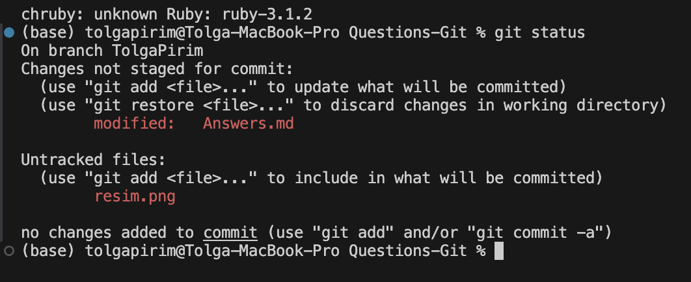
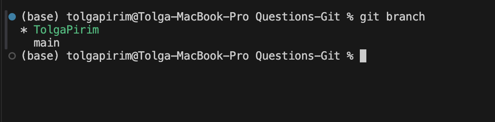
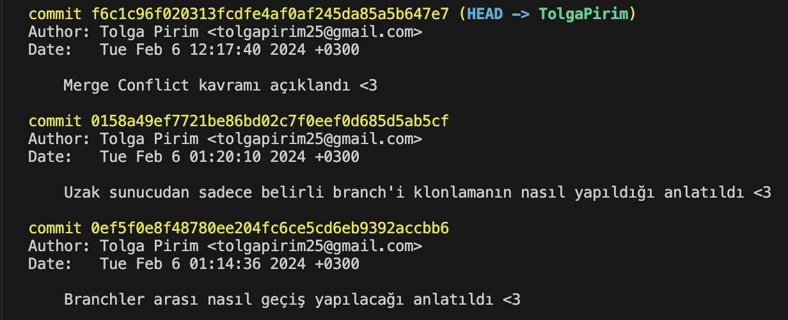
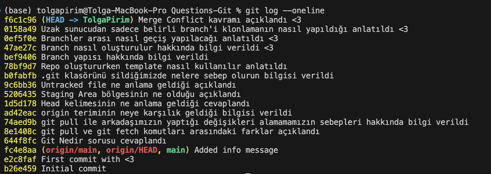
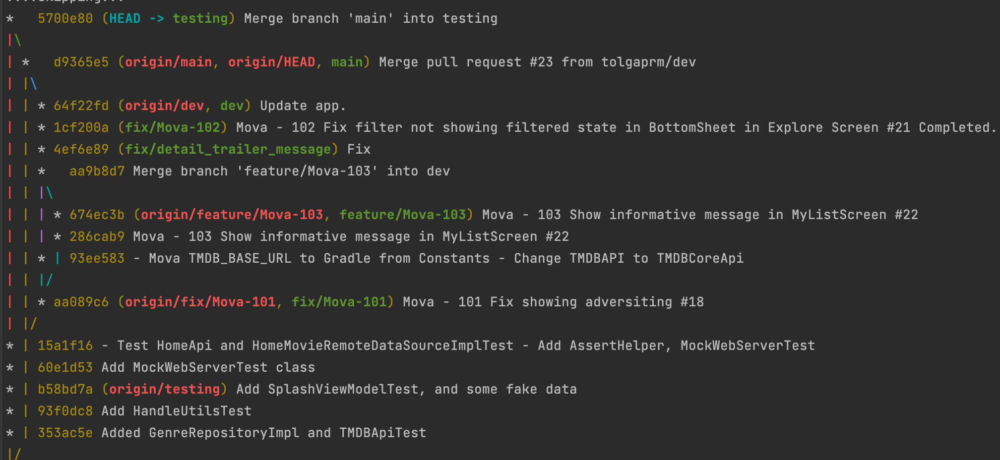
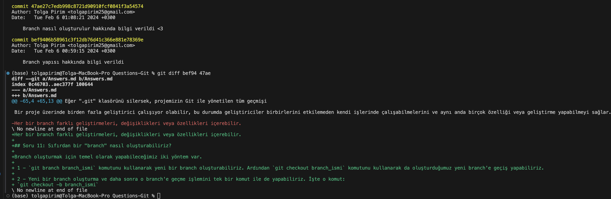
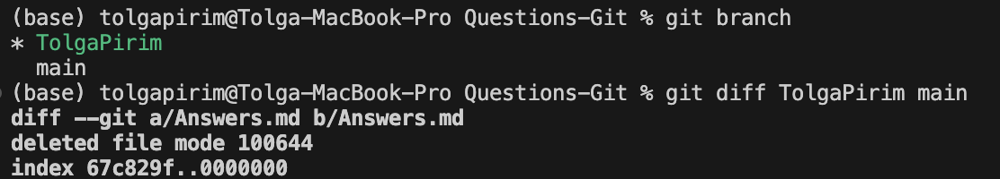
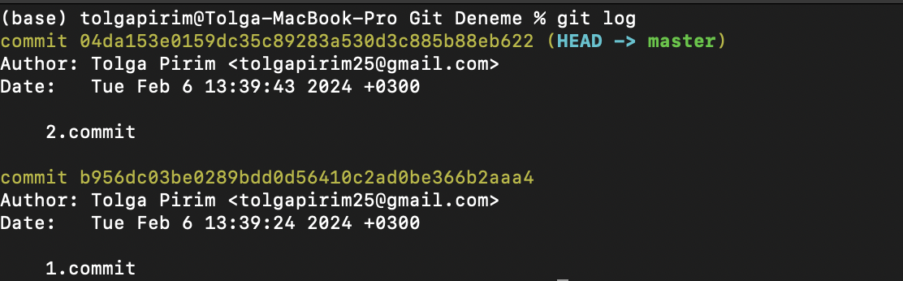
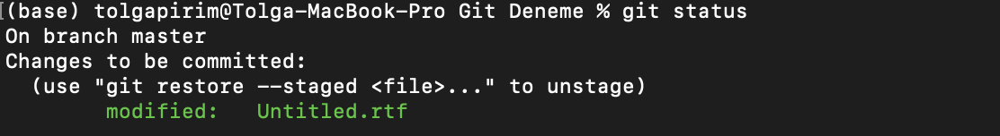

## Soru 1: Git Nedir?

Git, Linux kurucusu Linus Torvalds tarafından geliştirilen bir versiyon kontrol sistemidir. 
Bu sistem bir proje üzerinde birden fazla kişinin çalışmasına, projede yapılan değişikliklerin daha kolay bir şekilde bu projede çalışan kişilere iletebilmeyi sağlayan, projede yaptığımız değişiklikleri takip edebildiğimiz, yapılan değişiklik kim tarafından yapıldığını gösteren bir versiyon kontrol sistemidir.

## Soru 2: `git pull` ile `git fetch` komutlarının farkı nedir?

- `git fetch` komutu, remote sunucudaki repoda veri değişikliği oldu ise o verileri çekmeyi amaçlar, ancak yerel çalışma dizinindeki dosyaları güncellemez.

- `git pull` komutu, **remote sunucudan veri çekmeyi ve otomatik olarak mevcut çalışma(local repository) dizinindeki dosyaları güncellemeyi amaçlar**.
Bu komut, `git fetch` ve ardından `git merge` işlemlerini birleştirerek kullanır. Yani, uzak depodan verileri çeker ve daha sonra otomatik olarak yerel çalışma dizinindeki dosyaları günceller.

## Soru 3: Eğer takım arkadaşımız "kodlarımı gönderdim, benim geliştirmemin üzerine devam et" derse ve gönderdiği kodları `git pull` ile lokalimize alamıyorsak nerelerde hata yapılmış olabilir?

Eğer gönderilen değişiklikleri `git pull` ile lokalimize alamıyorsak, arkadaşımız yazdığı kodları remote sunucuda bulunan repoya göndermemiştir. Yani `git push` komutunu kullanmamıştır.

Yani arkadaşımız değişiklikleri yaptıktan sonra `git commit -m ""` yaptıktan sonra yaptığı değişikliklerin uzak sunucuya gönderildiğini sanmış ama `git push` komutunu kullanarak herhangi bir şekilde işlem yapmadığı için değişiklikler uzak sunucuya gönderilmemiş ve bizde bu değişikleri `git pull` ile local çalışma alanımıza dahil edemedik.

## Soru 4: `git fetch origin` komutundaki *origin* neye karşılık gelmektedir?

`git fetch origin` komutundaki *origin* ifadesi remote repositoryi temsil eden bir isimdir. 

**origin terimi**, varsayılan olarak birçok Git deposunda kullanılan yaygın bir isimdir, ancak projenizin yapılandırmasına bağlı olarak farklı bir isim de kullanılabilir. Eğer Git'e remote bağlantı eklerken farklı bir isim kullanmış olsa idik onu kullanmamız gerekirdi.

#### Peki Bunun Yapılandırmasını Nasıl Yapıyorduk?

`git remote add istediğimizBirİsim url` komutunu kullanarak ayarlamasını yapıyorduk. :)

## Soru 5: "HEAD" kelimesi neyi temsil etmektedir?

**HEAD** kavramını bir gösterge veya işaretci olarak düşünebiliriz.     
Anlık olarak çalışmış olduğumuz ortam hakkında bilgi verir. 
- Bu en son atılmış commit
- Yada üzerinde çalışma yapmış olduğumuz branch
- Veya geçmişde var olan bir commit'i incelemek istedim ve o commite geçtim, bunu bir örnek ile anlatayım. Örneğin 1,2,3,4 adında commitlerimiz var. Şu anda **HEAD** kavramı 4'ü(en son commit) işaret eder. Ben bir ihtiyaç doğrultusunda 2. commit'te geçip sadece o commit sırasında yapılmış olan değişiklikleri incelemek istedim ve 2. commit'e geçiş yaptım. Bu durumda **HEAD** 2. commit'i temsil eder.

## Soru 6: "Staging Area" ya da "Index" diye isimlendirilen bölge tam olarak ne demektir?

**Staging Area** veya **Index**, Git'in commit yapmadan önce değişiklikleri hazırlamanızı sağlayan bir ara bölgedir. Bu bölge, projenizdeki dosyalarda yaptığınız değişiklikleri seçip, bir sonraki commit'e dahil etmek üzere belirlemenizi sağlar. Bu ara bölge sayesinde, projenizdeki birden fazla değişikliği gruplamak, sadece belirli dosyaları commit'e dahil etmek veya commit yapmadan önce değişiklikleri kontrol etmek gibi avantajlar elde edersiniz. 

`git add` komutunu kullanarak dosyalarımı **Staging Area** kısmına ekleme işlemini yaparız.

## Soru 7: "Untracked file" ne demektir?

*Untracked file* kelime anlamından da anlayabileceğimiz gibi, Git tarafından takip edilmeyen dosyalardır. Bu dosyalar, projenizde bulunabilir, ancak Git bu dosyaların değişikliklerini veya durumunu izlemez.

Örneğin bu dosyamıza resim adında bir görüntü ekledim. Şimdi `git status` ile güncel durumumuza bir bakalım.

resim.png dosyasını ben daha önceden `git add` kullanarak ekleme yapmadığım için Untracked kısmında duruyor ve Git tarafından takip edilmediği anlamına geliyor.

## Soru 8: ".git" klasörünü silersek ne olur?

Eğer ".git" klasörünü silersek, projemizin Git ile yönetilen tüm geçmişi, branch bilgileri, commit bilgileri gibi Git ile ilişkilendirilmiş tüm veriler kaybolur.

## Soru 9: Kendi lokalimizde her `git init` komutunu kullanıdığımızda otomatik olarak "ReadMe.md" dosyası oluşturulmasını istiyorsak ne yapmalıyız?

Öncelikle içerisinde Readme.md olan bir şablon dosya hazırlayacağız. Ardından yeni bir repo oluşturmak istediğimizde `git init -- template [şablonDosyası konumu]` komutunu kullanarak oluşturabiliriz.

## Soru 10: Git konusunda bahsi geçen "branch" yapısı nedir? Bize ne sağlar?

Bir proje üzerinde birden fazla geliştirici çalışıyor olabilir, bu durumda geliştiriciler birbirlerini etkilemeden kendi işlerinde çalışabilmelerini ve aynı anda birçok özelliği veya geliştirme yapabilmeyi sağlar.

Her bir branch farklı geliştirmeleri, değişiklikleri veya özellikleri içerebilir.

## Soru 11: Sıfırdan bir "branch" nasıl oluşturabiliriz?

Branch oluşturmak için temel olarak yapabileceğimiz iki yöntem var.

 1 - `git branch branch_ismi` komutunu kullanarak yeni bir branch oluşturabiliriz. Ardından `git checkout branch_ismi` komutunu kullanarak da oluşturduğumuz yeni branch'e geçiş yapabiliriz.

 2 - Yeni bir branch oluşturma ve daha sonra o branch'e geçme işlemini tek bir komut ile de yapabiliriz. İşte o komut:
 `git checkout -b branch_ismi`

 ## Soru 12: Var olan bir "branch"e nasıl geçebiliriz?

Branchler arası geçişin nasıl yapıldığını söylemeden önce hangi branch üzerinde olduğumuzu nasıl öğrenebiliriz ona bakalım.

Bu bilgiyi öğrenebilmek için `git branch` komutunu kullanabiliriz. Mevcut yani şu anda çalışmış olduğumuz branch yıldız(*) ile işaretlenmiş olan branchdir.

Branch değiştirmek için kullanabildiğimiz komutlar.
- `git checkout branch_ismi`
- `git switch branch_ismi` 

## Soru 13: "git clone" komutunu kullanırken belirli bir spesifik branch'i sadece çekmek istiyorsak nasıl yapabiliriz?

Remote sunucudan sadece belirli bir branch'i çekmek istiyorsak;
`git clone -b branch_ismi url` komutunu kullanabiliriz.
 Örneğin **ödev** adında bir branchimiz olsun ve remote sunucudan sadece bu branchi çekmek istiyorsak;
 
  `git clone -b ödev url`

  ## Soru 14: "Merge conflict" ne demektir?

 Developerlar farklı branchler üzerinde çalışıp işlerini bitirdikten sonra bunları tek bir branch üzerinde birleştirmemiz gerekir.

 Ama bu aşamada eğer geliştiriciler 
 - aynı dosya üzerinde aynı satırda değişiklik yaptılarsa, 
 - veya birisi dosyayı silmişken, diğer geliştirici o dosya üzerinde başka bir değişiklik yaptı ise

 bu durumda **merge conflict** meydana gelir.
 Ekip üyeleri meydana gelen bu çatışmayı manuel olarak düzetlmek zorundadır.

 ## Soru 15: `git log` komutu ile hangi bilgileri görebiliriz?

 `git log` komutu, bir Git deposundaki commit geçmişini görüntülemek için kullanılır.

#### Her bir commit hakkında aağıdaki bilgileri gösterir.
 
 - **Commit Hash:** Her bir commit için benzersiz bir id
 - **Yazar Bilgisi:** Değişikliğin kim tarafından yapıldığı bilgisi
 - **Tarih ve Saat:** Commitin ne zaman yapıldığı
 - **Commit Mesajı:** Yapılan değişikliği açıklayan bir commit mesajı

 

Bu `git log` komutuna ekleyebileceğimiz farklı parametler olabilir bunlardan bazıları;

### `git log --oneline`
Logların her birini tek satırda göstermek için kullanılır.

### `git log --oneline --all --graph`

Burada –all bütün branchleri dahil ederek commit mesajlarını gösteriyor.
–graph yapısı ise bir grafik olarak göstermemizi sağlıyor.

## Soru 16: "git diff" ile kaç farklı iki durumun arasındaki değişiklikleri görebiliriz?

`git diff` komutu ile iki durum arasındaki değişiklikleri görmek için kullanılır.

### Hangi durumlar arasındaki değişiklikleri görebiliriz ve bunların komutları:

1 - `git diff`

    Bu komut çalışma dizininde(Working Directory) yaptığımız ancak Staging Area alanına eklenmemiş değişiklikleri görmek için kullanırız.

2 - `git diff --staged` && `git diff --cached`

    Bu komut, staging alana eklenmiş ancak henüz commitlenmemiş değişiklikleri gösterir.

3 - `git diff commit_id other_commit_id`

    Bu komut, belirli iki commit arasındaki değişiklikleri gösterir.
    Burada commit_id kısmında id kısmının hepsini yazmamıza gerek yok.

4 - `git diff branch_name other_branch_name`

    Bu komut, Bu komut, belirli iki branch arasındaki değişiklikleri gösterir.

## Soru 17: Git reset ile neyi geri alıyoruz?
`git reset` komutu, Git deposundaki commit geçmişini ve staging alanını yönetmek için kullanılır.

Öncelikle ilk kullanım alanı staging Area kısmına eklenmiş olan dosyaları bu kısımdan kaldırmamıza olanak sağlar.

- Yada herhangi bir commite geçmek ve ondan sonraki atılmış olan tüm commitleri silmek için kullanırız.

`git reset commit_id`

Örneğin 1,2,3,4 commitlerimiz var. Ve benim yapmak istediğim 2. commite geçmek aynı zamanda 3. ve 4. commitleride log historyimden silmek istiyorum.

Şimdi bu komutu kullanırken --soft, --hard gibi parametreler alır. Bunlar ne işe yarıyor birde bunlara bakalım.

### `git reset --soft commit_id`

    Yukarıdaki örneği ele alalım, yani 2.commit'e geçmek istiyorum ve 3. ve 4. commitleri silmek istiyorum. 

    Ama biz 3. ve 4. commitlerde birkaç değişiklik yaptık ve bunları kaybetmek istemiyorum diyorsak bu komutu kullanabiliriz. 

`git reset --soft 04da` komutunu kullanarak istediğim işlemi yapıyorum. Bu işlemi yaptıktan sonra bir git loglarımıza bakalım ve birde status durumumuza bakalım.

    Yeni logumuza baktığımızda 3. ve 4. commitlerin silindiğini görmüş oluyoruz.

    Status kısmına baktığımızda ise 3. ve 4. commitlerde yaptığımız değişikler staging Area kısmına eklenmiş.

### `git reset --hard commit_id`

    Yukarıdaki ile aynı işlemi yapar ancak 3. ve 4. commit'de yaptığım değişiklikleri kalıcı olarak siler.

## Soru 18: `git commit` ile `git push` arasındaki fark nedir?  

    git commit lokalde değişiklikleri kaydetmek için kullanılırken, git push bu değişiklikleri uzak bir depoya göndermek ve diğerlerinin erişimine açmak için kullanılır.

## Soru 19:Atomic commit ne demektir?

    Her bir commitin tek bir mantıksal değişiklikle ilişkili olan commit mesajları atmaktır. 
    Örneğin, bir projede bir özellik ekleniyorsa, bu özellikle ilgili tüm kod parçaları, testler ve dokümantasyonlar tek bir commit içinde toplanarak bir atomic commit oluşturulabilir.

## Soru 20: Repository ne demektir?

    Repository, bir projenin tüm dosyalarını, geçmişini ve konfigürasyon bilgilerini içeren bir depolama ve yönetim yeridir.

## Soru 21: "git tag" nedir? "git branch"’ten farkı nedir?

   -  **git tag** etiketleme işlemi yapar ve genellikle projenin sürüm numarasını veya önemli bir noktayı işaretler.

   -  **git branch** ise proje içinde farklı geliştirme dalları oluşturur ve paralel olarak çalışan farklı özelliklerin veya değişikliklerin ayrı dallarda geliştirilmesini sağlar.

   -  Taglar genellikle sabit bir noktayı işaretlerken, branchler genellikle belirli bir özellik veya geliştirme hattını temsil eder.

## Soru 22: Git'i görsel olarak kullanabilmek için hangi üçüncü taraf araçları ve uygulamaları kullanabiliriz?

1 - [Sublime Merge](https://www.sublimemerge.com/)

2 - [Megit](https://github.com/eclipsesource/megit)

3 - [Git Tower](https://www.git-tower.com/windows)

4 - [Source Tree](https://www.sourcetreeapp.com/)

5 - [Git Fork](https://git-fork.com/)

6 - [Git Kraken](https://www.gitkraken.com/git-client) - Ücretli

7 - [Tortoise Git](https://tortoisegit.org/)

8 - [Github Desktop](https://desktop.github.com/)

9 - [Smart Git](https://www.syntevo.com/smartgit/)

## Soru 23: GitHub" ile "git" arasındaki fark nedir? GitHub benzeri diğer siteler nelerdir?

Git: Bir sürüm kontrol sistemi olarak, projelerin lokal makinelerde depolanması ve takibi için kullanılır.

GitHub: Git depolarını barındıran ve sosyal özellikler sunan bir platformdur. GitHub üzerinden projelerinizi paylaşabilir, işbirliği yapabilir ve diğer geliştiricilerle etkileşimde bulunabilirsiniz.

Gitlab, Bitbucket, SourceForge gibi siteler örnek olarak verilebilir.

## Soru 24: main ya da master branch'inin diğer branchlerden farkı nedir?

Main veya master branchi git reposu oluşturulduğunda otomatik olarak oluşturulan ve varsayılan bir branchdir.

Bu brancler, genellikle test edilmiş, stabil ve güvenilir bir durumu temsil eder. 
Bu branch üzerinde var olan kodların sorunsuz bir şekilde çalıştığı ve canlıda olan kod
olarak temsil edilir.