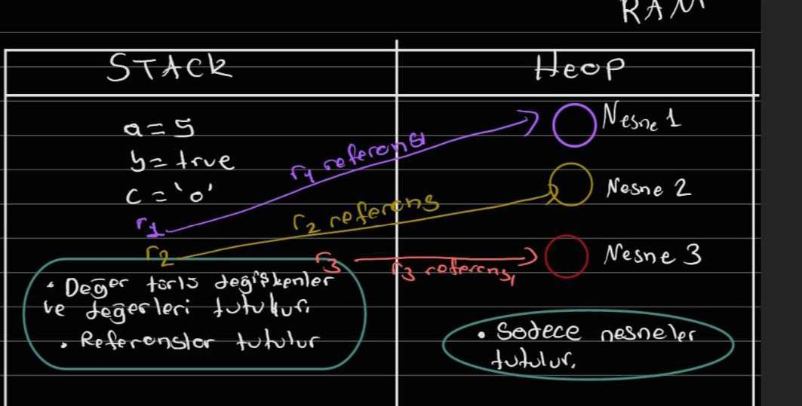

### 1. Değişkenler Bellekte Nasıl Saklanır? Stack - Heap Kavramları

Değişkenlerin bellek(RAM) üzerinde nasıl saklandığına bir göz atalım.
RAM üzerinde `STACK` ve `HEAP` olarak adlandırılan iki bölüm bulunur.

- `STACK` bölümünde primitive ifadelerin değerleri bu bölümde tutulur. Primitive değişkenlerin hızlı olmasının
  sebeplerinden
  birisi bellekte bu bölümde tutulmalarıdır. Çünkü `STACK`, `HEAP`'den daha hızlı çalışır.

- `HEAP` bölümünde ise reference değerli olan tiplerin (class) değerleri ve nesneleri `HEAP` bölümünde,
- bu değerlerin adreslerini gösteren değişkenler ise `STACK` bölümünde tutulur.

  