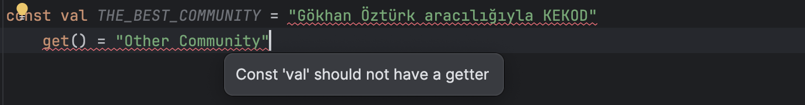
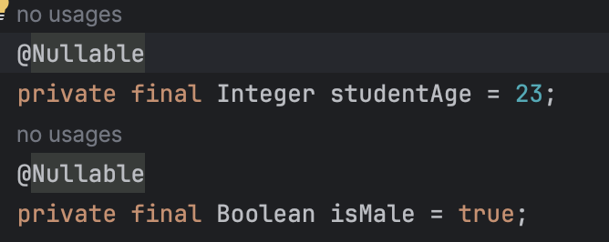

### 1 - Kotlin'de Primitive Tipler

- Öncelikle Primitive Tipler'in tam olarak ne olduğunu anlamaya çalışalım.

> Primivite tipler normalde, hem kapladıkları alan, hem de erişim hızları
bakımından reference tipli değişkenlere göre (yani bir class'ın nesnesine)
göre çok daha hızlı çalışan değişken tipleridir.
> `Int,Long,Double,Float,Boolean` gibi değişken türleri.

- Primitive Değişkenler
    - Primitive değişkenler doğrudan bellekteki değeri tutar.
    - Değişken, gerçek değeri içerdiği için bellekte daha düşük bir miktarda alan kaplar.
    - İki primitive tipi karşılaştırırken, değerlerin doğrudan karşılaştırılması yapılır.


- Reference Tipler
    - Bu tipler, bellekte bir referans (adres) tutar ve gerçek değer nesnenin içindedir.
    - İki reference tipi karşılaştırırken, referanslar (adresler) karşılaştırılır, yani iki değişken aynı nesneyi mi
      gösteriyor kontrol edilir.

  Kotlin'in resmi dokümantasyonuna baktığımızda
  `In Kotlin, everything is an object in the sense that you can call member functions and properties on any variable.`
  diye
  bir ifade geçiyor. `Yani kısaca Kotlin'de her şey bir objedir/nesnedir.`

  Ama biz daha yeni yukarıdaki bilgilere göre objelerin `reference` değer tiplerine denk geldiğini öğrenmiştik. İşte
  burada o can alıcı
  sorumuz geliyor.

- ### Peki Kotlin'de herşey birer obje ise, Primitive değişken oluşturamıyor muyuz?

  Kotlin'de primitive tipler birer sınıf (class) gibi görünürler. Ama çalışma zamanında (runtime) primitive hallerine
  optimize edilirler.

  Bunun gerçekten böyle okup olmadığını anlamak istersek, IDE'nin sunduğu `Show Kotlin Byte Code` aracını kullanarak
  deneyebiliriz.

  Kotlin ve Java bir JVM dili olduğu için compile edildiklerinde aynı assemble kodlarını üretirler.

    ```java
        // JAVA
      public class Primitives {
        private int age = 23; // Primitive
        private Integer ageObject = 23; // Reference
  
        private boolean isMale = true; // Primitive
        private Boolean isMaleObject = true; // Reference
    }
   ```
  Yukarıdaki Java kodumuza baktığımızda değişkenleri hem primitive olarak hemde reference olarak
  belirtebildiğimizi fark etmiş olmalısınız.

    ```kt
        // KOTLIN 
        class Primitives{
            private val age:Int = 23
            private val isMale:Boolean = true
        }     
    ```

  Şimdi yazmış olduğumuz Kotlin kodunu `Show Kotlin Byte Code` aracını kullanarak oluşturulan assemble
  kodunu decompile ederek Java'daki karşılığını görelim.
  > Araca erişmek için `Tools/Kotlin/Show Kotlin Byte Code`

  Yukarıda yazmıl olduğumuz Kotlin kodunu decompile ettikten sonra oluşturulan Java kodu:
  ```java
    public final class Primitives {
        private final int age = 23;
        private final boolean isMale = true;
  }
  ```
  Yukarıdaki kodu incelediğimizde aslında biz Kotlin'de Int olarak belirtmiş olduğumuz bir değişken
  compile edildikten sonra int yani primitive olarak saklanıyor. Diğer primitive değişkenler için de geçerlidir.

### 2 - val Değişkenler Immutable değildir. Sadece read-only'dir.

`val` değişkenlere genelde Immutable olarak söylendiğini duyarız. Ama aslında bu yanlış bir ifadedir.

Çünkü;

`immutable` ifadesi değer atandıktan sonra değişkenin/nesnenin durumu hiçbir şekilde ilk değerden farklı olamaz anlamına
gelmektedir.

`readOnly` ifadesi ise ilk değer atamasından sonra tekrar değer atanamaz demektir. Ama farklı zamanlarda farklı sonuçlar
üretebilir.
Yani değeri okunulabilen ama set edilemeyen değişkenlerdir.

#### Peki ben ilk değer atamasından sonra tekrar değer ataması yapamıyorum `val` ifadelere, bu durumda nasıl her seferinde farklı sonuçlar üretebilir ki dediğinizi duyar gibiyim? Hadi buna bir örnek üzerinden bakalım.

 ```kt
class Box {
    var width: Int = 20
    var height: Int = 40
    var length: Int = 50
    var usedSpace: Int = 0

    val avaliableSpace: Int
        get() = (width * height * length) - usedSpace
}
 ```

Bir Box sınıfımız var ve bu sınıfta width, height ,length ,usedSpace ve avaliableSpace değişkenleri bulunuyor.
`avaliableSpace` değişkenine baktığımzda get fonksiyonu güncellenmiş (*bunu ileride property konusunda detaylı bir
şekilde öğreneceğiz.*)
width, height, length değerlerini çarpımını alıp usedSpace değişkeninden çıkarma işlemi gerçekleştirildiğini görüyoruz.
Yani her seferinde `avaliableSpace` değişkeni çağrıldığında width, height, length ve usedSpace değişkenlerinin anlık
değerleri
ile hesaplama yapıp güncel değeri bize döndürecek demektir. Bu durumda benim değişkenim(`avaliableSpace`) `val` olmasına
rağmen
farklı sonuçlar elde edebilmiş olup, değiştirilmiş oldu. İşte tam da bu yüzden `val` değişkenlere `readOnly` diyoruz.

> Bununla alakalı derste belirtilen Medium makale linkini ekliyorum:
> [Kotlin: val is read-only not immutable ](https://xabaras.medium.com/kotlin-val-is-read-only-not-immutable-585ce2e5359b)

- ### const val ve val arasındaki fark nedir? Neden `const val` immutable bir değişken olabiliyorken `val` immutable bir değişken olamıyor?
  `const val` ile `val` arasındaki en bilinen fark `const val` değişkenlerinin derleme zamanında (compile time),
  `val` değişkenlerinin ise çalışma zamanında (runtime) belirtilmesidir.

  Asıl sorumuzun cevabına gelirsek, bunu arkasındaki ana sebep `const val` ile tanımlanmış bir değişkene
  hiçbir şekilde `get()` property'sini ekleyemiyoruz. `Immutable` olmasının arkasındaki sebep işte budur.

`const val` bir değişkene `get` eklemeye çalıştığımızda IDE'nin hata verdiğini göreceğiz.


> Çünkü BEST_COMMUNITY hiçbir şekilde değişmeyecektir :) < 3

### 3 - Kotlin'de Nullable(?) İfadeler

- ### Nullable Değişkenler Nedir ve Nasıl Tanımlanır?

  Bir değişkeni `null` olarak belirtmek o değişkenin herhangi bir değere sahip olmadığını ifade eder.

  Kotlin değişkenlerde **null tutabilen (nullable references)** ve **tutamayan (non-nullable references)** referanslar
  arasında ayrım yapar. Örneğin `Int` değişkeni `null` bir değer tutamaz.
  ```kt
  val age: Int = null 
  // IDE bize böyle bir uyarı mesajı gösterecektir. "Null can not be a value of a non-null type Int"
  ```
  `Nullable` bir değer alabilmesi için değişken tiplerimizin sonuna `?` ekleyerek, bu değişkenin artık null
  bir değer tutabildiğini belirtmiş oluyoruz.

  ```kt
  val age: Int? = null
  ```

- ### Nothing Değişkenler

  Eğer bir değişkenin tipi açık bir şekilde (explicit) olarak belirtilmezse ve değişkene `null` ataması yapılırsa,
  IDE Tip Çıkarımı (Type Inference) sırasında bu değişkenin tipini `Nothing?` olarak belirler.

  ```kt
    val number = null
  ```

  > Nothing değişkenler daha çok herhangi bir fonksiyonun bir değer döndürmek zorunda olmadığı
  durumlarda kullanılır. Genelde exception fırlatmalarda görürüz.
  Unit'den farklıdır ama Unit bir boş da olsa bir değer döndüğünü söyler Nothing hiçbir şeydir.

- ### `!!` ve `?.` Operatörlerinin Kullanımı
    - `!!` (Not-null assert) Operatörü:
      Bu operatörü kullanarak bu değişkenin zorla IDE'ya null olmayacağını garanti ettiğimizi belirtiyoruz.
      Ancak eğer ifade `null` ise `NullPointerException` hatası alırız.
      ```kt
        val name: String? = "Hello, World!"
        name!!.lowercase() 
       //Eğer değişken null ise program çalışma zamanında (runtime)'da NullPointerException hatasını fırlatır.
       //ama null değil ise zaten işlemi gerçekleştirir ve herhangi bir hata meydana gelmez.
        ```

    - `?.` (Safe call) Operatörü: Bu operatör, bir ifadenin `null` olup olmadığını kontrol eder ve `null` ise ifadeyi
      çağırmaz,
      `null` değilse normal şekilde devam eder.

      ```kt
        val name: String? = "Hello, World!"
        name?.lowercase() 
        // Eğer name değişkeni null ise bu işlemi(lowercase yapma) gerçekleştirmez ve herhangi bir hata meydana getirmez.
       // Eğer null değil ise işlemi gerçekleştirir.
      ```
- ### Peki ne zaman `!!` veya `?.` kullanmalıyız? Bunun Best Practice Nedir?
  Eğer `nullable` olan bir ifadeyi kullandığımız yerdeki bilginin **doğru olarak gösterilmesi çok önemli** ise bu kısımda `!!` operatörünü kullanırız ve uygulamamızın çökmesini isteriz. 
  Ama eğer orada gösterilecek bilgi çok önemli değil ise `?.` operatörünü kullanabiliriz. Eğer `null` olduğunda **başka bir değer gösterme ihtiyacımız** var ise o zamanda `?: - elvis operatörünü`  kullanırız.

- ### Primitive Tipleri Nullable Yaptığımızda Ne Olur?

  Gelin buna Kotlin'de primitive bir değeri `null` yaptığımız bir kodun `Show Kotlin Byte Code` ile decompile edip
  oluşturulmuş Java koduna bakalım.

  ```kt
      val studentAge: Int? = 23
      val isMale: Boolean? = true
  ```
  Gelin şimdi de bir oluşturulan Java kodumuza bakalım.

    
    > Üsteki Java koduna baktığımızda `studentAge` değişkenin `Integer`,
     `isMale` değişkeninin `Boolean` olarak yazıldığına dikkat edelim. Daha önce Java yazmadıysanız
    tam olarak ne söylemek istediğimi anlamamış olabilirsiniz. Java'da primitive değişkenlerin tiplerinin yazımı
   genelde küçük harfle başlar. Örnek `int`, `float`, `boolean`, `double` gibi. Yine aynı şekilde Java'da reference tipe
  > sahip bir değişken oluşturmak istediğimizde `Integer`, `Float`, `Boolean`, `Double` kullanılır.
    
  Öğrendiğimiz bu bilgilere göre Kotlin'de primitive olan bir değişkeni `Nullable` yaparsak, o değişken 
  artık reference değerli tip olarak işlem görecektir.

### 4 - Kotlin'de Numbers Değişkenler

  Kotlin sayıları temsil etmek amaçlı birden fazla tip sağlar. Bu tipler arasındaki farklar hafızada (memory)
  kapladıkları alan ve sahip olabileceği max ve min değer aralıklarıdır.

  - ### Değişkenlerin değer aralıkları?

| Type	 |Size (bits)|Min value |Max value |
|--------|:---------:|:--------:|:--------:|
| `Byte`	 |     8     |   -128   |   127    |
| `Short`	 |    16     |  -32768  |  32767   |
| `Int`	 |    32     |-2,147,483,648 (-2<sup>31</sup>)|2,147,483,647 (2<sup>31</sup> - 1) |
| `Long`	 |    64     |-9,223,372,036,854,775,808 (-2<sup>63</sup>)|9,223,372,036,854,775,807 (2<sup>63</sup> - 1)|

> **Hatırlatma!!** Challenglarda dikkat edilmesi gereken kısımlardan biriside bu tiplerin kullanımı
> olduğu derste söylenmişti. Challenglarda dikkat edilmesi gereken bölüme ulaşmak için [Challenge_Dikkat_Edilmesi_Gerekenler](../challenge/Challenge_Dikkat_Edilmesi_Gerekenler.md)
> buradan ulaşabilirsiniz.
 
Ondalıklı sayılar için;

| Type	 |Size (bits)|Significant bits|Exponent bits|Decimal digits|
|--------|:---------:|:--------------:|:-----------:|:------------:|
| `Float`	 |    32     |       24       |      8      |      6-7      |
| `Double` |    64     |       53       |     11      |     15-16     |    

 Kotlin'de bazı değerleri belirtirken;
 - `Long` - değişkenler için sayının sonuna `L` konularak değer ataması yapılabilir.
 - `Float` - değişkenler için sayının sonuna `F`,`f` konularak değer ataması yapılabilir.

  ```kt
    val eFloat = 2.718f
    val pi = 3.14f
    val threeBillion = 3_000_000_000L // Number değişken tanımı yapılırken underscore "_" kullanılabilir.
  ```
 > ### Bir Genel Kültür Bilgisi :) <3
 > Float kısmında `f` ve `F` varken, Long kısmında neden sadece `L` var ve küçük `l` kullanamıyoruz? 
 > 
> Bunun cevabı bazı fontlarda `l` `1(bir)`'e benzediği için kullanılmaz. :)

- ### Unsigned Değişkenler Nedir?
  -  Unsigned değişkenler, programlama dillerinde genellikle sayısal değerleri temsil etmek için kullanılan ve
  **yalnızca pozitif değerleri ve sıfırı alabilen** özel bir veri türüdür. 

  - Bu türler, değer aralığındaki **negatif değerlere** izin vermez.

  | Type     | Size (bits) | Min value |                    Max value                    |
  |----------|:-----------:|:---------:|:-----------------------------------------------:|
  | `UByte`  |      8      |     0     |                       255                       |
  | `UShort` |     16      |     0     |                     65,535                      |
  | `UInt`   |     32      |     0     |       4,294,967,295 (2<sup>32</sup> - 1)        |
  | `ULong`  |     64      |     0     | 18,446,744,073,709,551,615 (2<sup>64</sup> - 1) |

- ### Boxed - UnBoxed ve Eşitlikler(`==` ve `===` Farkı Nedir?)
  - **Boxed:** Değişkenin obje referansı olarak tutulmasıdır.
  - **UnBoxed:** Değişkenin primitive olarak tutulmasıdır.
- ### `==` ve `===` Operatörleri Arasındaki Fark Nedir?
    > `==` operatörü değişkenlerin değerine(value) göre bir karşılaştırma yaparken;
    > 
    > `===` operatörü iki nesnenin aynı bellek konumunu referans edip etmediğini kontrol eder.
  
- ### Reference Değer Karşılaştırmasında Byte Aralığının Oluşturduğu Spesifik Durum
  
  ```kt
    // Byte aralığı içerisinde
    val boxedNumber: Int? = 127
    val anotherBoxedNumber: Int? = 127
    println(boxedNumber === anotherBoxedNumber) // true

    val number2: Int = 129 // Byte aralığı içerisinde değil.
    val boxedNumber2: Int? = number2
    val anotherBoxedNumber2: Int? = number2
    println(boxedNumber2 === anotherBoxedNumber2) // false
  ```

  Yukarıdaki Kotlin koduna baktığımızda iki işlemde reference karşılaştırması yapıyor. Ama birisinde
  `false` değeri dönerken, diğer işlemde `true` değeri dönüyor. Bunun tam olarak sebebi JVM dillerinde 
  `byte` aralığında olan tam sayılar için özel bir optimizasyondan dolayıdır.
  
  > Kotlin'de -128 ile 127 arasındaki `byte` tam sayıları için **aynı bellek konumunu paylaşan bir özel optimizasyon vardır** 
  > ve bu nedenle bu aralıktaki tamsayılar için değer karşılaştırması yapılır.

### 5 -Type Conversion

Type Conversion bir veri tipinin başka bir veri tipine dönüştürülmesi anlamına gelir.
Kotlin'de implicit type conversion yoktur. (Explicit) Açık bir şekilde hangi türe dönüştürülmesi gerektiğini belirtmeliyiz. 

`toByte(): Byte`

`toShort(): Short`

`toInt(): Int`

`toLong(): Long`

`toFloat(): Float`

`toDouble(): Double`

 - Değer aralığı küçük olan tipler, büyük olan tiplere sorunsuz bir şekilde dönüştürülebilir.
    ```kt
    val schoolNumber: Short = 1809
    val convertedNumber = schoolNumber.toInt()
    println(convertedNumber) // Çıktı: 1809
    ```
- Ama **büyük değer aralığına** sahip olan bir değişkeni, **küçük değer aralığına** sahip olan bir değişken tipine dönüştürme işlemi yaptığınızda, anlamsız bir sonuç alabilirsiniz.
- Örneğin, 1809 sayısını `Int` değişkeninden `Byte` değişkenine dönüştürmeye çalıştığınızda, `byte` değişkenin değer aralığı `-128 ile +127` arasında olduğundan, 1809 değeri bu aralığın dışında kalacak ve sonuç beklenmedik bir şekilde sınırlı bir değerle temsil edilecektir. **Bu durum, veri kaybına ve programın doğru çalışmamasına neden olabilir.**
    ```kt
    val schoolNumber = 1809
    val convertedValue = schoolNumber.toByte()
    println(convertedValue) // Çıktı: 17
    ```