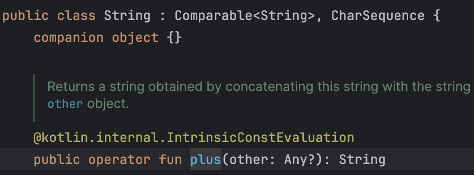
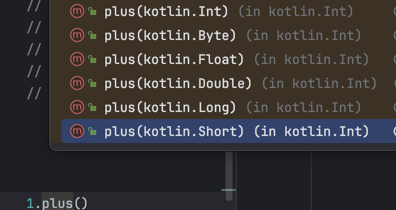
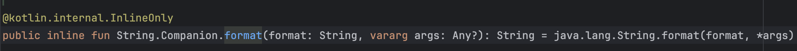

### 1. Değişkenler Bellekte Nasıl Saklanır? Stack - Heap Kavramları

Değişkenlerin bellek(RAM) üzerinde nasıl saklandığına bir göz atalım.
RAM üzerinde `STACK` ve `HEAP` olarak adlandırılan iki bölüm bulunur.

- `STACK` bölümünde primitive ifadelerin değerleri bu bölümde tutulur. Primitive değişkenlerin hızlı olmasının
  sebeplerinden
  birisi bellekte bu bölümde tutulmalarıdır. Çünkü `STACK`, `HEAP`'den daha hızlı çalışır.

- `HEAP` bölümünde ise reference değerli olan tiplerin (class) değerleri ve nesneleri `HEAP` bölümünde,
- bu değerlerin adreslerini gösteren değişkenler ise `STACK` bölümünde tutulur.


  
  
### 2. Smart Cast Nedir?
  - `is` ve `!is` Operatörleri
    
    Çalışma zamanında (runtime) bir nesnenin belirli bir türe uygun olup olmadığı işleminin kontrol 
    edilmesi işlemidir.
    
    ```kt
    val value: Any = "Merhaba, Kotlin!"

    if (value is String) {
        println(value.length)
    }

    if (value !is Int) {
        println("Değişken bir Int türünde değildir.")
    }
    ```
    
    Örneğin bu örnekte `Any` tipine sahip bir değişkenimiz var. İlk olarak, `is` anahtar kelimesiyle, değişkenin `String` 
    türünde olup olmadığını kontrol ediyoruz. Eğer öyleyse, ilgili mesajı yazdırıyoruz. Ardından, `!is` kullanarak,
    değişkenin `Int` türünde olmadığını kontrol ediyoruz.


  - Peki  `Smart Cast` Nedir?

    Kotlin dilinde bir değişkenin tipi üzerinde `compiler` tarafından otomatik olarak dönüşümün gerçekleştirilme
    işlemidir. Bu şekilde açık bir şekilde `Type Conversion` işlemini yapmadan o tipin sahip olduğu bütün özellikleri
    methodları kullanmamıza sağlar.

    Yine yukarıdaki örnekten devam edelim, `value` değişkeninin `String` olup olmadığını kontrol ettik ve 
    `if` içerisinde açık bir şekilde `Type Conversion` işlemini yapmadan `String` tipine ait olan `length` özelliğini
    kullanabildim. İşte tam olarak bu duruma `Smart Cast(Akıllı Dönüşüm)` denir.
    
    ### 3. İki `Int.MAX` Değerin Toplanması Durumu

    ```kt
    val totalIntMax = Int.MAX_VALUE + Int.MAX_VALUE

    println(totalIntMax) // Sonuç: -2
    ```
    
    Burada INT değerlerinin max değerleri ile bir toplama işlemi gerçekleştiriyorum ve `totalIntMax` değişkenim
    `Long` bir değer olması gerekirken `Int` bir değer olarak belirleniyor.
    
    Ama biz bir önceki hafta eğer değer `Int` değer aralığının üzerinde ise `Type Inference` ile bu değişkenin
    `Long` olarak atanacağını öğrenmiştik. Evet bu bilgi doğru ama IDE aritmetik işlemler de bu şekilde bir belirleme yapmıyor.
    
    Önce olası durumlara bir bakalım:

    ```kt
    val intValuePlusLong = 34 + 43L // Long Toplama işleminde hangi tipin aralık değeri fazla ise o değerin tipi belirlenir.
    val byteMaxPlusByteMax = Byte.MAX_VALUE + Byte.MAX_VALUE // Int
    val shortMaxPlusShortMax = Short.MAX_VALUE + Short.MAX_VALUE // Int
    ``` 
    `Short` ve `Byte` değerlerlerini topladığımızda ise tip `Int` olarak belirlenir. Burada yine dilin bu değerler için sağlamış
    olduğu özel optimizasyonlar sebebi ile `Int` olarak atanır.

    #### Peki neden `Int.MAX_VALUE + Int.MAX_VALUE` toplamını yaptığımızda tip `Long` olarak belirlenir?
    
    Burada IDE her bir toplama işlemi yapıldığında hangi değer aralığına geleceğini kontrol etmiyor. Bunu yapamaz mı?
    İsterse tabiki yapar sadece bir if kontrolü gerekiyor. Ama biz her toplama işlemi yaptığımızda arka planda bu işlem 
    kontrolü sağlanacak ve bu da ek bir maliyet getirir.
    Buradan `Defansif Programlama` kavramına bir geçiş yapalım.

    - #### Defansif Programlama Nedir?
    
        Yazılımcıların yazdıkları kodda olası tüm durumları (edge case) ele alması durumudur.
        Burada gerçekten bütün edge case durumlarını değerlendirmelimiyiz. Bu en uç noktadaki edge case
        durumunu değerlendirmek bize bir performans kaybı yaratır mı? Eğer yaratacaksa bunu gerçekten kullanmalımıyız?
        
        Yukarıdaki örnek gibi eğer her toplama işleminde bu değerlerin `Int` max değerini geçtiğini kontrol yapılsa idi 
        gereksiz bir maliyet oluşturacaktı.

### 4. Characters (`Char`)

- ### Char Bir Değişken Tanımlama
    
    - 2 byte(16bits) alan yer kaplar.
    - Tek tırnakların '' arasına harf, sayi, escape karakterlerini veya unicode yazarak kullanırız.
    - Çift tırnak "" kullanırsak `String` olur.
    
    ```kt
      val firstCharOfName = 'T'
      val firstCharOfName2 = "T" // String
      val firstCharOfName3 = 'TO'
    ```
    Yukarıdaki `firstCharOfName3` gibi tek tırnaklar içerisine birden fazla character ekleyemeyiz.
    
- ### ASCII Tablosu
    - ASCII tablosu, ASCII karakterlerini ve karşılık gelen sayısal değerleri içeren bir tablodur. 
    - ASCII tablosu, temel Latin alfabesi karakterlerini, rakamları, noktalama işaretlerini ve diğer özel karakterleri içerir.

    <details>
     <summary>ASCII TABLOSU</summary>
     
  
    </details>
  
    Eğer bir karakter ifadeyi `toInt()` veya `code` ile `Int` bir değere döndürmeye
    çalıştığımızda bize geri dönecek olan değer tabloda  bu karaktere denk gelen `decimal` karşılığını verecektir.

    ```kt
    println('H'.code) // 72
    println('P'.code) // 80
    println('7'.code) // 55
    ```
    - Burada `toInt()` de kullanabilirdik ama bu fonksiyon `Deprecated` bir duruma geçmiş bunun yerine `code` property 
    kullanmamız isteniyor.
    
    - Eğer karakter içerisindeki sayısal değer ile işlem yapmak istiyorum bunun ASCII tablosundaki decimal karşılığını
    istemiyorum diyorsak, `digitToInt()` fonksiyonunu kullanabiliriz.
    ```kt
     println('7'.digitToInt()) // 7 - Bu sefer decimal karşılığını vermedi.
    ```
    - Burada dikkat etmemiz gereken bir durum var. Eğer char içerisinde Int'e dönüşü yapılamayacak bir değer var ise 
    program `IllegalArgumentException` hatasını verecektir.
    ```kt
  println('T'.digitToInt())
    ```

- ### Escape (Kaçış) Karakterleri
    
  - `\t`: Tab kadar bir boşluk bırakır.
  - `\b`:
  - `\n`: Yeni bir satıra geçmemizi sağlar.
  - `\r`: Satır başına dönmek için kullanılır.
  - `\'`: Tek tırnak karakterini kullanmak için. Örneğin bir String ifade içerisinde 
   ```"Bu bir tek tırnak içeren bir string\'dir."``` Bunu print ile çıktısını almaya çalıştığımızda sonuç 
  `Bu bir tek tırnak içeren bir string'dir.`
  - `\"`: Çift tırnak karakterini kullanmak için 
  - `\$`: Dollar ($) işaretini kullanmak için 

- ### Unicode
    Unicode, bilgisayar sistemlerinde metin ve sembollerin temsil edilmesi için kullanılan bir karakter kodlama standardıdır.
    Farklı dil ve alfabeleri destekler. (Örneğin Çince veya Japonca alfabelerini) - UTF-8, UTF-16, ve UTF-32 gibi çeşitleri vardır.
    Bu çeşitler arasındaki fark, destekledikleri toplam sembol, karakter sayısı ve kapladıkları alan bakımından kaynaklıdır.
    
    Unicode'da her bir sembolün özel bir kodu bulunur ve biz bu kodları kullanarak programlarımıza entegre edebiliriz.
    
    Kalp elde etmek için
    ```kt 
    print(`\u2665`) 
    ```
- ### Unicode ve ASCII Arasındaki Fark Nedir?
  - **ASCII**: Temel olarak İngilizce alfabesini ve birkaç temel sembolü içerir. Farklı dil ve kültürlerdeki özel karakterlere destek vermez.
  - **Unicode**: Dünya genelinde birçok dil ve kültürü destekler, bu da metin ve sembollerin daha geniş bir yelpazesini temsil etmesine olanak tanır.

### 5. Boolean
- ### Boolean Bir Değişken Tanımlama
  - 2 byte yani 8 bit alan kaplar.
  - `true` yada `false` ataması için kullanılır. Aynı zamanda `null` değerde alabilir.
  - Bazı programlama dillerinde `0` veya `1` de boolean olarak kabul edilebilir ama Kotlin'de kabul edilmez.


- ### Karşılaştırma Operatörleri (`&& - || - !`)
  - `&& - and` - Eğer karşılaştırılan iki değer de `true` ise sonuç `true` olur. Eğer ifadelerden herhangi birisi `false` ise
  `false` cevabını elde ederiz.
     ```kt
     val isAndroidDeveloper = true
     val isKeko:Boolean = false
   
    if(isAndroidDeveloper && isKeko){}
   
    if (isAndroidDeveloper and isKeko){} // Infix Fonksiyon İle Kullanımı
   
    if (isAndroidDeveloper.and(isKeko)){} // Extension Fonksiyon İle Kullanımı
     ```
  - `|| - or` - Eğer karşılaştırılan iki değerden en az birisi `true` ise sonuç `true` olur. Bu karşılaştırmada `false` 
olması için iki değerinde `false` olması gerekiyor.
    ```kt
    val isAndroidDeveloper = true
    val isKeko:Boolean = false

    if(isAndroidDeveloper || isKeko){}

    if (isAndroidDeveloper or isKeko){} // Infix Fonksiyon İle Kullanımı

    if (isAndroidDeveloper.or(isKeko)){} // Extension Fonksiyon İle Kullanımı
     ```
  - `! - not` - Bu operatör ile değerimiz `true` ise `false`, `false` ise `true` yapar.
    ```kt
      val isAndroidDeveloper = true
      println(!isAndroidDeveloper) // Sonuç: false
      println(isAndroidDeveloper.not()) // Sonuç: false // Extension Fonksiyon İle Kullanımı
    ```
    > Boolean değerlerin `true` olma durumunu kontrol etmek için `== true` şeklinde açıkca belirtmeye gerek yoktur. Ama 
     `Nullable` olan değerler için açık bir şekilde kontrol işlemi gerçekleştirmeliyiz.
    > ```kt
    > if (isAndroidDeveloper) {}
    > ```
    > Değişkenimiz `null` olduğunda artık 3 durumumuz var.
     Bunlar `true`, `false` ve `null` olması
    > 
    > ```kt
    >  val isSuccess: Boolean? = null
    > if (isSuccess == true) {
    > 
    > } else {
    >   // Geri kalan iki durum için else durumunu kullanır.
    >  }
    > ```
    
- ### Bu Operatörlerin Lazily Çalışma Mantığına Sahip Olması
    `&&` ve `||` operatörleri Lazily çalışma mantığına sahiptir. Bu mantığa sahip olması demek;
    
  - Eğer `||`  ile iki değeri kontrol ettiğimizde ilk değer `true` ise, ikinci değer hiçbir şekilde kontrol edilmez. Ama
    ilk değer `false` ise, diğer ifadenin de kontrol işlemi gerçekleştirilir.
  - Eğer `&&`  ile iki değeri kontrol ettiğimizde ilk değer `true` ise, ikinci değer de kontrol edilir. Ama ilk değer `false`
    ise ikinci ifadenin kontrol işlemi gerçekleştirilmez.

### 6. String
- ### String Bir Değişken Tanımlama ve String'de Index Yapısı
  - Yaklaşık olarak her karakter 2 byte (16 bits) yer kaplar.
  - Çit tırnak `""` içerisine yazılan karakterler bütünüdür.
  - `String` bir değişken üzerindeki her bir karaktere index operatorü ile tek tek ulaşabiliriz. 
     ```kt
      private val name = "Tolga"
      println(name[0]) // T -- Indexler 0 ile başlar
     println(name[1]) // o
     println(name[5]) // Tolga string ifadesi 5 length uzunluğuna sahip ama bu ifadenin son
    // karakterine ulaşmak istediğimizde indexini 4 olarak belirtmeliyiz. Çünkü indexlenen 
    // ifadelerde index 0 (sıfır) ile başlar.
    // Olmayan bir index'e ulaşmak istediğimizde ise program bize StringIndexOutOfBoundsException hatasını
    // fırlatır.
    ```
- ### `String` Immutable'dır
    String değişkenler immutabledır. Yani bir kez tanımlandıktan sonra, değerini değiştiremeyiz yada yeni bir değer
    set edilemez.
    > Şimdi aklımıza söyle bir soru gelmiş olabilir. Ben `var` keywordünü kullanarak `String` tanımladıktan sonra o değişkenin
    değerini değiştirebiliyorum. Ama sen burada yeni bir değer atayamazsın ve değiştiremezsin diyorsun. Tam olarak anlamdım
  > diyebilirsin?
  > #### Şimdi gelelim cevabımıza:
  > Bunun arkasındaki yatan sebep `String` değişkenlerin bellekte saklanma durumlarından dolayıdır. Hatırlarsanız bu haftanın
  > ilk sorusunda `HEAP` ve `STACK` kavramlarından bahsetmiştik. Reference değerli olan değişkenlerin `value` ları `HEAP`
  > tarafında ve bu value değerini referans eden değişkenlerin ise `Stack` bölümünde tutulduğundan konuşmuştuk.
  > `String` değişkenlerin de değerleri **primitive** bir değişken olmasına rağmen `Heap` bölümünde tutulur. Yani biz 
  > `String` bir değişkene değer atadığımızda `HEAP` bölümünde yeni bir nesne oluşturulur ve değişkenimiz o nesneyi referans eder.
  > `String` üzerinde yapacağımız tüm işlemler bize yeni bir `string` nesnesi dönecektir.
  ```kt
    val name = "Tolga"
    println(name.uppercase()) // TOLGA
    println(name) // Tolga name değişkeni üzerinde değişiklik yapmadı. 
    // Eğer ben String bir ifade üzerinde işlem yaptıktan sonra, işlem gerçekleşmiş değişken
    // ile işlemlerime devam etmek istiyorum diyorsanız onu yeni bir değişkene atamamız gerekiyor.
    
    val nameUppercase = name.uppercase() 
    println(nameUppercase) // TOLGA
  ```
- ### Stringler'de `+` Operatörü - Birleştirme İşlemleri
  - Farklı tipteki bir değişkenin önüne `String` bir değişken yada ifade koyarak toplarsak(+) operatörü ile, sonuç `String` olacaktır. 
  - Ancak bir `String` değişken yada ifadenin sonuna + operatörü ile farklı tipte bir değişken eklersek kod çalışmaz ve bize hata verecektir.
  ```kt
    val numbersValue = "value" + (4+5+6) // value15
    val numbersValue2 = (4+5+6) + "" // Hata verecektir. 
  ```
  > 
  > Burada bu işlemin çalışmamasının arkasındaki sebep `String` değişkenlerin `plus` operatör fonksiyonuna
  > baktığımızda `Any` tipine sahip değişkenleri kabul ederken
  > 
  > 
  > `Int` değişkenin `plus()` operatör fonksiyonu `Byte,Short,Int,Float,Double` kabul ediyor.

- ### String Template Kullanımı - `Length:${name.length}`
  Kotlin'de herhangi bir değişken `+` operatörüne ihtiyaç duyulmadan direkt olarak `""`(çift tırnak) arasına yazılarak 
  kullanılabilir.
- Bunun için `$` işaretine ihtiyacımız vardır. Bu yapıya **String Template** denir.
  ```kt
    val age = 23
    println("Age: $age") // Age: 23
  ```
- Eğer değişkenin herhangi bir özelliğine erişmek istiyorsanız `${}` ile kullanılır.

  ```kt
    val name = "Tolga"
    println("$name.length: ${name.length}") // Tolga.length: 5
  ```
- ### String `format()` Fonksiyonu
  - Bu method, belirli bir `String` içinde yer tutucuları(placeholder) belirtilen değerlerle değiştirerek yeni bir `String` oluşturmamıza olanak tanır.
  > Kotlin'deki `format()` fonksiyonu arka planda Javadaki format fonksiyonunu kullanır.
  > 
  > 

  **Placeholders**:
  -  `%s` : String
  -  `%d` Integer için
  - ` %f `Float/Double
  -  `%n` Yeni bir satıra geçmek için
    
    ```kt
        val boy = 1.854
        val boyMessage = String.format("Boyum: %.2f metre", boy)
         println(boyMesaj) 
    ```
    >  Burada 1.85 döndürür. Sondaki 4'ü almaz Çünkü biz 2 ondalık basamak kısmını al dedik.
     2f 2 ondalık basamakla olduğunu belirtir. Noktadan sonra ne kadar ifade alacağını belirtmiş olduk.
    ```kt
        val sayi = 1234567.8954768
        val usFormat = String.format(Locale.US, "US formatında: %,.2f", sayi)
        // //Türkçe için Locale nesnesi, "tr" ISO 639 dil kodu ve "TR" ISO 3166 Ülke kodu ile oluşturulabilir
        val localeTR = Locale("tr", "TR") // Türkçe için Locale nesnesi oluşturuluyor.
        val trFormat = String.format(localeTR, "TR formatında: %,.2f", sayi)
  
        print(usFormat) // US formatında: 1,234,567.89" yazdırır.
        print(trFormat) // TR formatında: 1.234.567,90" yazdırır.
    ```
   > Peki burada ki `,.2f` kısmındaki ilk virgül neyi temsil ediyor.
   > Yukarıdaki sayı değeri ingilizce de normalde `1,234,567.8954768` bu şekilde olduğu için yani yüzdelik kısımları
  ayırmak için `,` , ondalık kısımları ayırmak için `.` kullanılıyor. Buradaki ilk `,` ifadesi sayıdaki `,` kısımlarını
  temsil etmiş oluyor. (Programlama İngilizce diline göre geliştirildiği için öyle kabul edilmiş) Yani biz bu fonksiyonda diyoruz ki ben bu formatta o kısımlara `,` koyacağım ama bunu
  **Türkçeye göre yap**.

### 7. Arrays
- ### Array Tanımlama
    Array'ler aynı türden veya interface yapısı `<>` içerisinde belirttiğimiz türün alt türlerinden **sabit sayıda** 
    değer tutan bir veri yapısıdır.

  - ### Object Type & Primitive Type Array 
    > Kotlin'de array oluşturmak istediğimizde iki tane seçenek önümüze çıkar. Bunlardan birisi `Object Type Array` bir 
     diğeri ise `Primitive Type Array`'dir. Bunların arasındaki temel fark yine bellekte nasıl saklandıkları ile ilgilidir.
     Ve `Primitive Type` olan türler her zaman `Object Type` olan türlere göre daha performanslı, daha hızlı ve daha az
     yer kapladığı için bunları tercih etmeliyiz.
  
    - #### Object Type Array Oluşturma
    
      Object Type Array oluşturmak için bize sunulan birçok yöntem bulunuyor. Bunlar;

        - `arrayOf()`: Hepsi aynı tipte olan veya bir `Any`(_Bu şu anda Any ama biz ileride class yapılarını gördüğümüzde kendi
       oluşturmuş olduğumuz classlarıda verebileceğiz._) ile belirtilmiş alt türleri de kabul eden array oluşturmak için kullanılır.
        ```kt
        val studentNumbers = arrayOf(13, 14, 15, 16) // Int Array
        val studentNames = arrayOf("Ömer", "Arda", "Doğaç") // String Array
        val studentHeight = arrayOf(185.3, 184.3, 180.0) // Double Array
        val differentTypeArray = arrayOf<Any>("Tolga", true, 23, 2.0)
        ```
      
        - `arrayOfNulls<Type>(size)`: Verilen `size` bilgisi kadar `null` değer bulunduran array oluşturmak için kullanılır.
        ```kt
        val arrayOfNulls = arrayOfNulls<String>(5)
        println("arrayOfNulls: ${arrayOfNulls.joinToString()}") 
        // Çıktı: arrayOfNulls: null, null, null, null, null
        ```
      
        > **joinToString() Fonksiyonu:** 
        Array içerisindeki elemanları aldığı bir seperator ile ayırarak `String` ifade döner.
        `Seperator` varsayılan olarak `virgül(,)` karakteridir.
      
        - `emptyArray<Type>()`: Bu fonksiyon ile boş bir array oluştururuz
        ```kt
        val emptyArray = emptyArray<Int>()
        println("emptyArray: ${emptyArray.joinToString()}")
        // Çıktı: emptyArray:  Boş olduğu için harhangi bir şey gösterilmiyor.
        ```
        > `emptyArray[3] = 60` diyerek bir eleman eklemeye çalıştığımızda `ArrayIndexOutOfBoundsException` hatasını alırız.
         Çünkü bu arrayin kaç değere sahip olacağını belirtmedik. Bu dizi aslında boş bir dizi olduğu için, bellekte bir dizi elemanı için yer ayrılmaz.
         Yani, bu durumda, sadece boş bir dizi referansı oluşturulmuş olur ve herhangi bir eleman içermez.
        - Constructor Yapısı ile `Array(size)`
        ```kt
            val studentNotes = Array(5){
             // Bazı işlemler yapılabilir
            it + 40
            } 
            println(studentNotes.joinToString()) // 40,41,42,43,44
        ```
        > Bu örnekte, Array(5) ifadesi 5 elemanlı bir array oluşturur. Süslü parantezler(higherOrder) içindeki
        kod bloğu her bir index değeri ile (it) ile 40 ekleyerek bir array oluşturur.

  - #### Primitive Type Array Oluşturma
    - Constructor Yapısı İle Oluşturma
    ```kt
    val booleanPrimitiveArray = BooleanArray(3)
    val bytePrimitiveArray = ByteArray(3)
    val charPrimitiveArray = CharArray(3)
    val doublePrimitiveArray = DoubleArray(3)
    val floatPrimitiveArray = FloatArray(3)
    val intPrimitiveArray = IntArray(3)
    val longPrimitiveArray = LongArray(3)
    val shortPrimitiveArray = ShortArray(3)
    
    println("booleanPrimitiveArray: ${booleanPrimitiveArray.joinToString()}")
    println("bytePrimitiveArray: ${bytePrimitiveArray.joinToString()}")
    println("charPrimitiveArray: ${charPrimitiveArray.joinToString()}")
    println("doublePrimitiveArray: ${doublePrimitiveArray.joinToString()}")
    println("floatPrimitiveArray: ${floatPrimitiveArray.joinToString()}")
    println("intPrimitiveArray: ${intPrimitiveArray.joinToString()}")
    println("longPrimitiveArray: ${longPrimitiveArray.joinToString()}")
    println("shortPrimitiveArray: ${shortPrimitiveArray.joinToString()}")
    ```
    Bu şekilde oluşturduğumuzda oluşturulan array'ler default değerler ile oluşturuluyor.
    Yukarıdaki yazdırdığımız işlemlerin çıktıları aşağıdaki gibi olacaktır.
    ```
    booleanPrimitiveArray: false, false, false
    bytePrimitiveArray: 0, 0, 0
    doublePrimitiveArray: 0.0, 0.0, 0.0
    floatPrimitiveArray: 0.0, 0.0, 0.0
    intPrimitiveArray: 0, 0, 0
    longPrimitiveArray: 0, 0, 0
    shortPrimitiveArray: 0, 0, 0
    ```
    
    - Fonksiyonlar İle Oluşturma
    ```kt
    val booleanPrimitiveArray2 = booleanArrayOf(true, false, true, true)
    val bytePrimitiveArray2 = byteArrayOf()
    val charPrimitiveArray2 = charArrayOf('A', 'B', 'C')
    val doublePrimitiveArray2 = doubleArrayOf()
    val floatPrimitiveArray2 = floatArrayOf()
    val intPrimitiveArray2 = intArrayOf(3, 4, 67)
    val longPrimitiveArray2 = longArrayOf()
    val shortPrimitiveArray2 = shortArrayOf()
    ```
    Bize sunulan hazır fonksiyonlar ilede bir array oluşturabiliriz. Fonksiyon içerisinde herhangi bir
    değer vermezsek bize bpş bir array oluşturur. Ama bizim istediğimiz değerler ile bir array oluşturulmasını
    istiyorsak o değerleri de fonksiyon parametresine argüman olarak verilebilir.

  - ### Object Type Array ve Primitive Type Array’ler Arasında Dönüşüm İşlemleri
  
    `Primitive type` olan bir array'i `Object Type` olan array'e dönüştürmek için `toTypedArray()` fonksiyonu kullanılır.
    ```kt
    val convertPrimitiveToObjectType = booleanPrimitiveArray.toTypedArray()
    // Artık bu array'imiz Array<Boolean> olacaktır.
    ```
    
    `Object Type` olan bir array'i `Primitive Type` olan bir array'e dönüştürmek için aşağıda belirtilen fonksiyonları
    kullanabiliriz:
    ```
    `toBooleanArray()`: Boolean primitive bir array'e dönüştürmek için kullanılır.
    `toByteArray()`: Byte primitive bir array'e dönüştürmek için kullanılır.
    `toCharArray()`: Char primitive bir array'e dönüştürmek için kullanılır.
    `toDoubleArray()`: Double primitive bir array'e dönüştürmek için kullanılır.
    `toFloatArray()`: Float primitive bir array'e dönüştürmek için kullanılır.
    `toIntArray()`: Int primitive bir array'e dönüştürmek için kullanılır.
    `toLongArray()`: Long primitive bir array'e dönüştürmek için kullanılır.
    `toShortArray()`: Short primitive bir array'e dönüştürmek için kullanılır.
    ```

  - ### Çok Boyutlu Diziler Oluşturma (Multi Dimensional Array)
    ```kt
    val twoDArray = Array(2) { Array(2) { 0 } }
    println("TwoD Array: ${twoDArray.contentDeepToString()}")  // [[0,0], [0,0]]
   
    val threeDArray = Array(2) { Array(2) { Array(2) { 0 } } }
    println("ThreeD Array: ${threeDArray.contentDeepToString()}")
    // [[[0, 0], [0, 0]], [[0, 0], [0, 0]]]
    ```
    > `contentDeepToString()` fonksiyonu çok boyutlu olan bir diziyi // [[0,0], [0,0]] şekilde ekrana yazdıran bir fonksiyondur.

- ### Array Karşılaştırmaları - `contentEquals` & `contenDeepEquals`
  Array'lerde `==` operatörü referans kontrolü yapıyor. Yani iki değişken de aynı referansına sahip olduğu kontrolü yapılıyor.
  
  Ama biz arraylerin içerisindeki değerlerin aynı olup olmadığı karşılaştırmasını yapmak istersek
  `contentEquals` yada `contentDeepEquals` kullanmalıyız.
  
  >Bu iki yöntem de: Karşılaştırılan iki array arasında **hem aynı değerlere sahip olup olmadığını** hemde
  **aynı sırada bulunup bulunmadığını** karşılaştırırç

  ```kt
   val simpleArray = arrayOf(1, 2, 3)
   val anotherArray = arrayOf(1, 2, 3)
   println("== İle Yapılan Karşılaştırma: ${simpleArray == anotherArray}") // false
   println("contentEquals() İle Yapılan Karşılaştırma: ${simpleArray.contentEquals(anotherArray)}") // true
    
  println(simpleArray contentEquals anotherArray) // İnfix olarak kullanımı
  ```
- ### Array'lerde Ekleme, Çıkarma İşlemleri Yapmak
  Array'lerin sabit bir büyüklüğü olduğundan bahsetmiştik. Array'lere ekleme, çıkarma işlemleri yaptığımızda Stringler'de
  olduğu gibi bellekte yeni bir array oluşturulur ve bizim değişkenimiz yeni oluşturulan array'in reference adresini tutar.
  Diğer array ise GarbageCollector ile belli bir zaman sonra yok edilecektir.
  
  ```kt
   var cities = arrayOf("Kayseri", "İstanbul", "İzmir")

   println("Cities Before Add Sivas: ${cities.joinToString()}")
   cities += "Sivas" // Adding Sivas
   println("Cities After Add Sivas: ${cities.joinToString()}")
   // Veya bu şekilde yani bir array eklemesi de yapılabilir.
   cities += arrayOf("Nevşehir", "Bursa")
   println("Cities After Add New Cities Array: ${cities.joinToString()}")
  
  // Çıktılar:
  // Cities Before Add Sivas: Kayseri, İstanbul, İzmir
  // Cities After Add Sivas: Kayseri, İstanbul, İzmir, Sivas
  // Cities After Add New Cities Array: Kayseri, İstanbul, İzmir, Sivas, Nevşehir, Bursa
  ```
  > `val` ile tanımlanmış bir arrayin herhangi bir index'deki değerini [] index operatörü ile değiştirebiliriz.
  `val` indexdeki değerlerin değişmesine karışmaz.
  Ancak bir array'i `val` ile tanımlanmış bir değişkene atamasını yapamayız. 
  ```kt
    val array3 = arrayOf(1, 2, 3, 4)
    println("Before Modify array3: ${array3.joinToString()}")
    array3[2] = 10 // Array'deki 2. indesde bulunan değeri 10 ile değiştirdim.
    println("After Modify array3 ${array3.joinToString()}")
  
   // Çıktılar
   // Before Modify array3: 1, 2, 3, 4
   // After Modify array3: 1, 2, 10, 4
  ```
  - ### Array'ler Invariant'dır
    Array'Ler invariantdır. Yani arrayler üst class'ları yerine atanamazlar.
    ```kt
    val arrayOfString = arrayOf("")
    var arrayOfAny: Array<Any> = arrayOfString
    // Burada bize bir type mismatch hatasını verecektir.
    ```
  - ### `vararg` ve `Spread(*)` Operatörü ile İlişkisi
    `vararg` keyword'ü ile fonksiyonlarımızda istediğimiz sayıda parametre kabul edilebilir.
    Eğer `vararg`a denk gelecek şekilde bir array kullanmak istiyorsak `spread *` operatörünü kullanabiliriz.
    > `vararg` konusunu ileride fonksiyonlarda daha detaylı bir şekilde göreceğiz.
    ```kt
    fun printAllStrings(vararg strings: String) {
        for (string in strings) {
            print(string)
        }
    }

    val lettersArray = arrayOf("c", "d")
    printAllStrings("a", "b", *lettersArray)
    ```
  - ### Array'lerde Bulunan Bazı Yardımcı Fonksiyonlar
    Array'lerde Collections yapılarında kullandığımız birçok yardımcı fonksiyonu da kullanabiliyoruz.
    Bunlardan bazıları `filter, first, last, find, shuffle` ve çok daha fazlası.
    > Bütün fonksiyonlara bakmak isterseniz:
     https://kotlinlang.org/api/latest/jvm/stdlib/kotlin/-array/
    ```kt
    val students = arrayOf("Tolga", "Gökhan", "Ömer", "Arda", "Barış", "Ayşe")

    val studentWithStartingA = students.filter { it.first() == 'A' }

    println("Student Starting name with A  $studentWithStartingA")

    val numbers = arrayOf(1, 2, 3, 4, 5)

    numbers.shuffle()

    println("Shuffled Numbers: ${numbers.joinToString()}")

    // Çıktılar
    // Student Starting name with A:  [Arda, Ayşe]
    // Shuffled Numbers: 2, 3, 1, 5, 4 // Bu çıktı her seferinde farklı sonuçlar alabilir.
    ```
  - ###  Array'leri Collections Yapılarına Dönüştürme İşlemleri - `Set`, `List`, `Map`